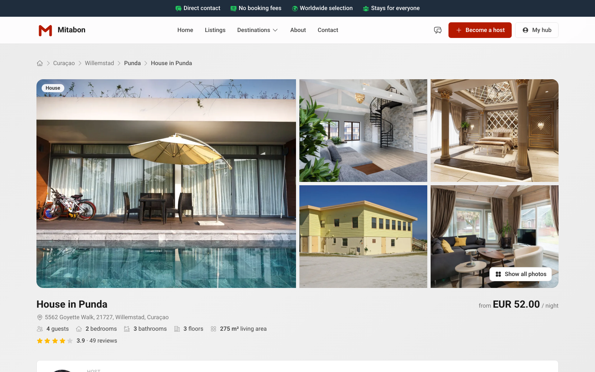

# Contabai

Property listings platform frontend for WordPress. The plugin connects a WordPress site to the Contabai platform and adds listings, search, booking, guest accounts, chat and reviews.

## Requirements

- WordPress 7.1 or newer
- PHP 8.3 or newer
- A Contabai host account (for your Host ID)

## Installation

1. Download `contabai.zip` from the latest [release](https://github.com/newmediacrew/contabai-plugin/releases/latest).
2. In wp-admin: **Plugins → Add New → Upload Plugin**, choose the zip, install and activate.
3. Go to **Contabai plugin → Basic** and fill in your **Host ID**.

On activation the plugin creates its pages (listings, listing, login, register, forgot password, verify email, account, profile, bookings, chat, book). All of them start with `contabai-`, so existing pages are never touched.

## Settings

| Tab | What |
|---|---|
| Basic | Host ID and the page slugs |
| Updates | Installed version, latest release, Check now |
| Advanced | API base URL, Verify SSL Certificate, Development mode, AI & SEO tools |

## Shortcodes

`[contabai_search]` `[contabai_listings]` `[contabai_random_listings]` `[contabai_listing]` `[contabai_book]` `[contabai_login_form]` `[contabai_register_form]` `[contabai_forgot_password_form]` `[contabai_verify_email]` `[contabai_account]` `[contabai_profile]` `[contabai_bookings]` `[contabai_chat]`

The full reference with attributes is in wp-admin under **Contabai plugin → Shortcodes**.

## Updates

New versions appear in **Dashboard → Updates** like any other plugin. **Development mode** (Advanced tab) switches this off for a development copy.

## Languages

English, Dutch, German, Spanish, French and Portuguese.

## Theme

Built to pair with the [Contabai Theme](https://github.com/newmediacrew/contabai-theme).

## Licence

GPLv2 or later, see [LICENSE](LICENSE).
